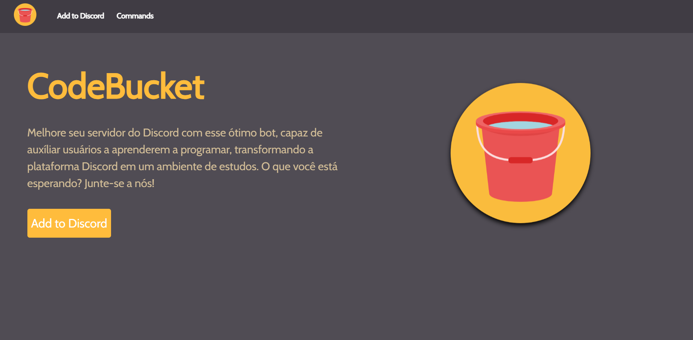
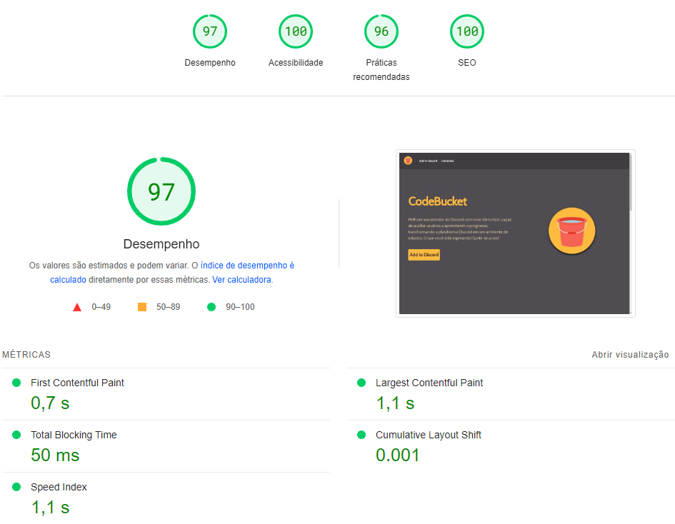

# Bem-vindo ao Site de Apresentação do CodeBucket! 🤖

Um site feito com o framework Angular e hospedado no Firebase, este site é meu **TCC do curso de Análise e Desenvolvimento de Sistemas** e apresentará um bot voltado para a área de programação que eu fiz! CodeBucket promete auxiliar pessoas que gostam de utilizar a plataforma Discord como um ambiente de estudos.

## 📂 Navegando pelo Site:

**Telas que usuários comuns têm acesso:**
- **[HOME](https://codebucketweb.web.app):** A tela principal, onde, para usuários comuns, há tudo necessário para adicionar o bot e entender para que serve.
- **[COMANDOS](https://codebucketweb.web.app/comandos):** Aqui você encontrará todos os comandos que o bot apresenta.
- **[LOGIN](https://codebucketweb.web.app/login):** O login levará para o modo admin, onde pode ser feito manutenção do site.

**Telas de admin:**
- **[WEB MANAGER](https://codebucketweb.web.app/webmanager):** Essa tela apresentará CRUDs de todo o site, onde eu posso escolher qual página eu quero editar.
  - **Configurações Gerais**
    - Opções de configuração geral do site.
  - **Páginas do Site**
    - **[HOME PAGE](https://codebucketweb.web.app/homeedit):** CRUD para edição da tela principal.
    - **[COMANDOS PAGE](https://codebucketweb.web.app/comandosedit):** CRUD para edição da tela de comandos.
    - **[FOOTER](https://codebucketweb.web.app/footer):** CRUD para edição do footer do site.
    - **[OUTRO](https://codebucketweb.web.app/outro):** CRUD para outras informações do site, como link do bot ou ícone do mesmo.
- **Comandos do Bot:**
  - **[LISTA DE COMANDOS](https://codebucketweb.web.app/itemlist):** Aqui está sendo listado todos os comandos que o bot apresenta.
  - **[EDITAR COMANDO](https://codebucketweb.web.app/itemedit):** CRUD para edição de algum comando específico.
  - **[CRIAR COMANDO](https://codebucketweb.web.app/itemcreate):** CRUD para criar um comando novo.

### 👨‍💻 Sobre o Bot:

Esse bot tem uma ideia super nichada, o objetivo é auxiliar usuários que usam o Discord para estudar programação. Pode-se dizer que ele é uma ferramenta para esse ambiente.

### 🎉 Sinta-se à vontade

Aproveite o site e o open-source que esse repositório apresenta, não é nada profissional, mas acredito que é suficiente.

> [Adicione o bot!](https://codebucketweb.web.app)

> [Repositório do bot!](https://github.com/emanuelsacoman/Bot-Estudos-Discord)

### ⚡ PageSpeed: 

Investi meu tempo para melhorar os gráficos abaixo.

- **Desempenho:** Reflete a rapidez e eficiência da página em carregar e responder às interações do usuário, com foco na otimização de recursos para tempos de carregamento mais rápidos.
  
- **Acessibilidade:** Avalia a capacidade da página de ser acessível a todos os usuários, incluindo aqueles com deficiências, garantindo práticas de codificação adequadas e facilitando a navegação por tecnologias assistivas.

- **Práticas Recomendadas:** Indica se a página segue as melhores práticas de desenvolvimento da web, incluindo a estrutura semântica, a eliminação de conteúdo duplicado e o uso correto de tags HTML para melhor compreensão por parte dos motores de busca e tecnologias assistivas.

- **SEO (Search Engine Optimization):** Reflete a capacidade da página de ser indexada e classificada pelos motores de busca, incluindo otimização de meta tags, URLs amigáveis e criação de conteúdo relevante para uma melhor visibilidade nos resultados de busca.

Não se esqueça de deixar uma ⭐ nesse repositório!
